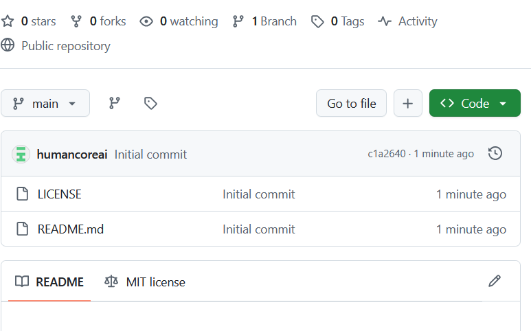

  

# HumanCore.ai

**HumanCore.ai** ist ein offenes, modulares KI-Agentensystem mit einem zentralen **Supervisor**, mehreren **Worker-Agenten**, einem vollständigen **Wizard-Setup**, **Dashboard**, **Workflow-System** und **Audit-Logs**.  
Es wurde entwickelt, um KI-gestützte Automatisierung für *jedermann* verständlich, sicher und flexibel nutzbar zu machen.

---

## 🚀 Features

- **Supervisor-System**  
  Zentrale Logik für Steuerung, Sicherheit, Routing & Priorisierung.

- **Wizard-Konfiguration**  
  Schritt-für-Schritt-Setup für Stil, Autonomie, Sicherheit, Aufbewahrung & Agentenparameter.

- **Dashboard**  
  Übersicht über Auslastung, aktive Prozesse, Statusindikatoren, Systemmeldungen und Aktivitäten.

- **Agenten-Modell (8 Worker + 1 Supervisor)**  
  Writer, Planner, Data, Research, Support, Workflow, Creative, Tech.

- **Workflow-System**  
  Standardprozesse (Entwürfe, Reports, interne Abläufe) mit Farbcodierung (grün/gelb/rot).

- **Audit-Log**  
  Transparente Systemereignisse, Versionierung & Sicherheitsfokus.

- **Gruppierbare Agenten**  
  Perfekt für Skalierung oder parallele Prozesse (Writer-1, Writer-2 …).

- **Datenschutz- & Aufbewahrungskonzept**  
  Konfigurierbare Log-Rotation, Anonymisierung, automatische Löschlogik.

---

## 🧩 Installation (lokal)

1. ZIP herunterladen  
2. Dateien entpacken  
3. `index.html` im Browser öffnen  
4. Wizard starten → System konfigurieren  
5. Nutzung komplett im Browser, ohne Backend

---

## 📦 Inhalt des UI-Pakets

- `index.html` – Hauptanwendung  
- `assets/style.css` – UI & Styling  
- `assets/app.js` – Logik, Wizard, Routing, Dashboard  
- Keine externen Server nötig (localStorage-basiert)

---

## 🔧 Roadmap

- Erweiterbare Agenten  
- Plugin-System  
- API-Brücke  
- Team-Modus  
- KI-gestützte Prozessoptimierung  
- Export/Import für Konfigurationen

---

## 📝 Lizenz

MIT – frei nutzbar, anpassbar, weiterentwickelbar.

---

## ❤️ Beitrag

Pull Requests, Issues, Ideen und Erweiterungen sind willkommen.
